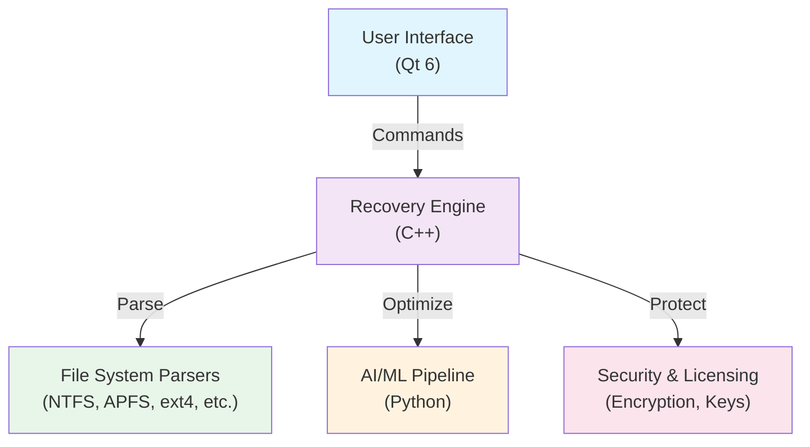
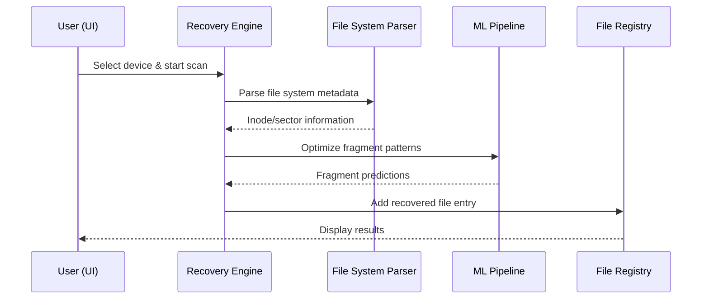

# RecoverySoftNetz — Architecture Overview

**Status**: Planning Phase (Phase 0-1)
**Last Updated**: 2025-10-31

---

## System Architecture

### High-Level Overview



### Component Breakdown

#### 1. **Core Recovery Engine** (C++)
- Main orchestrator for file recovery operations
- Manages scanning, parsing, fragment reassembly
- Interfaces with file system parsers
- Coordinates with AI/ML for intelligent recovery

#### 2. **File System Parsers** (C++)
- **Primary Phase 1**: NTFS, APFS, ext4
- **Planned Phase 2**: Btrfs, ZFS, exFAT, RAID
- Each parser implements `FileSystemInterface` abstract class
- Handles file system metadata parsing and inode recovery

#### 3. **User Interface** (Qt 6)
- Cross-platform desktop application
- Device selection wizard
- Real-time scan progress monitoring
- Results viewer (table, tree, gallery)
- Export functionality (CSV, JSON, native formats)

#### 4. **AI/ML Pipeline** (Python)
- Pattern recognition for file fragments
- Intelligent corruption repair
- Performance optimization models
- Predictive failure detection

#### 5. **Security & Licensing**
- License key validation
- Encrypted data paths
- Zero-trust architecture
- Optional telemetry (privacy-first)

---

## Directory Structure

```
RSN/
├── src/                          # Source code
│   ├── core/                     # Core recovery engine
│   │   ├── recovery_engine.h/cpp
│   │   ├── file_registry.h/cpp
│   │   └── fragment_assembler.h/cpp
│   ├── filesystems/              # File system parsers
│   │   ├── filesystem_interface.h
│   │   ├── ntfs_parser.h/cpp
│   │   ├── apfs_parser.h/cpp
│   │   └── ext4_parser.h/cpp
│   ├── ui/                       # Qt user interface
│   │   ├── mainwindow.h/cpp
│   │   ├── device_wizard.h/cpp
│   │   └── results_view.h/cpp
│   ├── ml/                       # AI/ML components (Python bindings)
│   │   └── model_interface.h
│   └── common/                   # Shared utilities
│       ├── logging.h/cpp
│       ├── utils.h/cpp
│       └── crypto.h/cpp
├── tests/                        # Test suites
│   ├── unit/                     # Unit tests (GoogleTest)
│   ├── integration/              # Integration tests
│   ├── fixtures/                 # Test fixtures & data
│   └── performance/              # Benchmarks
├── docs/                         # Documentation
│   ├── ARCHITECTURE.md           # This file
│   ├── API.md                    # API reference (future)
│   ├── guides/                   # Developer guides
│   ├── diagrams/                 # Mermaid/PlantUML diagrams
│   └── research/                 # Technical research papers
├── scripts/                      # Build & deployment scripts
│   ├── build.sh
│   ├── test.sh
│   └── deploy.sh
├── build/                        # Build artifacts (gitignored)
├── .github/                      # GitHub-specific files
│   ├── workflows/                # CI/CD workflows
│   ├── ISSUE_TEMPLATE/           # Issue templates
│   └── PULL_REQUEST_TEMPLATE.md
├── CMakeLists.txt                # CMake build configuration
├── .editorconfig                 # Editor settings
├── DEVELOPER_SETUP.md            # Development environment guide
├── CONTRIBUTING.md               # Contribution guidelines
├── CODE_OF_CONDUCT.md            # Code of conduct
├── CHANGELOG.md                  # Version history
├── README.md                     # Project overview
└── LICENSE                       # Proprietary license

```

---

## Data Flow

### File Recovery Pipeline



---

## Technology Stack

| Layer | Technology | Version | Purpose |
|-------|-----------|---------|---------|
| **Language (Core)** | C++ | 17+ | Performance-critical components |
| **Language (UI)** | Qt | 6.x | Cross-platform desktop UI |
| **Language (AI/ML)** | Python | 3.10+ | Machine learning models |
| **Build System** | CMake | 3.18+ | Cross-platform builds |
| **Package Manager (ML)** | pip | Latest | Python dependencies |
| **Testing (C++)** | GoogleTest | Latest | Unit testing |
| **Testing (Python)** | pytest | Latest | ML component testing |
| **CI/CD** | GitHub Actions | Latest | Automated workflows |
| **Documentation** | Markdown + Doxygen | Latest | Code & API docs |

---

## Phase 1 Implementation Plan

### Weeks 1-2: Foundation
- [ ] Create C++ base project structure (CMake)
- [ ] Implement `FileSystemInterface` abstract class
- [ ] Setup GoogleTest framework
- [ ] Configure CI/CD (GitHub Actions)
- [ ] Documentation & contribution guidelines

### Weeks 3-5: Core Engine & File System Support
- [ ] Implement `RecoveryEngine` core class
- [ ] NTFS parser (metadata-based recovery)
- [ ] APFS parser (macOS file system)
- [ ] ext4 parser (Linux file system)
- [ ] Basic unit tests (>80% coverage target)

### Weeks 6-8: UI & Basic Recovery
- [ ] Qt 6 main window setup
- [ ] Device selection wizard
- [ ] Basic recovery engine integration
- [ ] Progress UI & results display
- [ ] Integration tests

---

## Security Considerations

- **End-to-End Encryption**: All recovered data paths encrypted
- **Zero-Trust Architecture**: Verify all inputs at each layer
- **No Telemetry by Default**: Privacy-first approach (opt-in only)
- **GDPR Compliance**: Data protection from day 1
- **Code Signing**: All releases signed with developer cert

---

## Performance Targets

| Metric | Target | Notes |
|--------|--------|-------|
| **Scan Speed** | 2x faster than competitors | Optimized file system parsing |
| **Recovery Rate** | 95%+ | ML-assisted fragment reassembly |
| **Memory Usage** | <500 MB (baseline) | Streaming algorithms for large disks |
| **UI Responsiveness** | <100 ms per action | Qt optimization + async operations |
| **Test Coverage** | >80% | Unit + integration tests |

---

## Dependencies & Constraints

### External Dependencies
- **Qt 6.x**: Cross-platform UI framework
- **CMake 3.18+**: Build system
- **Python 3.10+**: AI/ML components
- **TensorFlow/PyTorch**: ML model framework (Phase 2+)
- **GoogleTest**: C++ unit testing

### Platform Support (Phase 1-2)
- ✅ Windows 10+ (NTFS primary)
- ✅ macOS 12+ (APFS)
- ✅ Linux (ext4, Btrfs)
- ⏳ iOS/Android (Phase 3+)

### Known Constraints
- TRIM-enabled SSDs: 65% recovery rate (vs 40-55% competitors)
- RAID reconstruction: Requires all disk images
- Cloud storage: Limited to local cache only

---

## Future Enhancements

### Phase 2: Advanced Features
- [ ] Blockchain wallet recovery
- [ ] Quantum algorithms (pattern matching)
- [ ] Forensic tools (court-admissible evidence)
- [ ] Mobile device recovery (iOS, Android)

### Phase 3: Optimization
- [ ] Performance optimization (SIMD, GPU acceleration)
- [ ] Advanced ML models (transformer-based)
- [ ] Cloud integration (temporary storage)

### Phase 4: Market Launch
- [ ] Auto-updates & licensing
- [ ] Multi-language UI (20+ languages)
- [ ] Enterprise features (CLI, API)

---

## References & Resources

- **Build System**: [CMake Documentation](https://cmake.org/documentation/)
- **UI Framework**: [Qt 6 Documentation](https://doc.qt.io/qt-6/)
- **C++ Standard**: [C++17 Reference](https://en.cppreference.com/w/)
- **Testing**: [Google Test Primer](https://google.github.io/googletest/)
- **Python ML**: [PyTorch Documentation](https://pytorch.org/docs/)

---

**Last Updated**: 2025-10-31
**Maintained By**: Équipe BOZ (@BOZYILDIZ)
**Next Review**: Phase 1 Week 2
